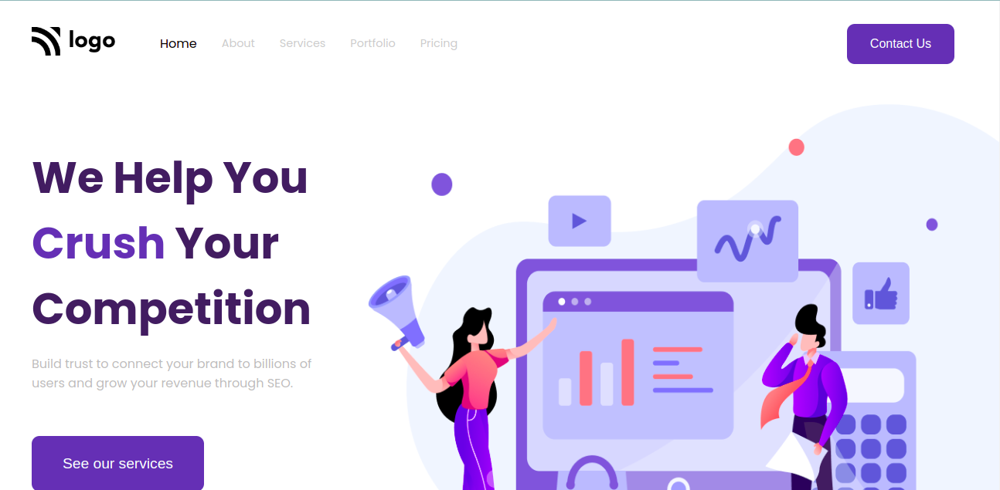

# Buisness website

- This is my **Fourth** project.

- This is a buisness website.After making this website I got a good grab on flex and position properties.I am confident and excited to make new projects.

- It took me 2-3hr to make this website.Link of project is below:

---

## Screenshot

---

## 🛠 Skills learned

HTML, CSS

---

## 🚀 About Me

### Hey, I am Yasir lambawala

- I am born and brought up in Vadodara, Gujarat. I have done my Btech at GTU university and I am currently learning Web-development.

---

## Feedback

- If you have any feedback, please reach me at lambawalay@gmail.com
